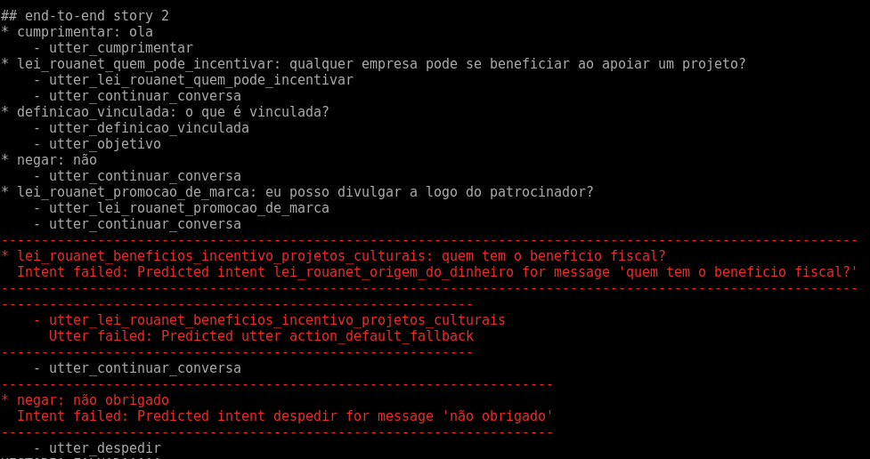
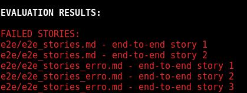

# Desafio da qualidade

Além do grande desafio de como gerenciar o conteúdo de maneira viável e organizada, existe o desafio de como crescer o domínio do bot com qualidade. À medida que a base de treinamento do bot muda, muitas vezes é necessário também atualizar os parâmetros de treinamento da rede para garantir que a acurácia do *bot* se mantenha.

Aliado à isso, no contexto colaborativo de uma equipe com diversas pessoas evoluindo o bot simultaneamente, é preciso alinhar a visão dos membros do time em relação aos parâmetros de qualidade.

# Qualidade em ChatBots Rasa

Se Tratando de Chatbots desenvolvidos com Rasa, os parâmetros de qualidade estão relacionados principalmente à dois aspectos:

**Identificação de intenções:** Qual o desempenho do *bot* em classificar um texto em uma categoria que define a sua intenção;

**Desempenho em fluxos de conversa:** O quão bem o *bot* consegue se comportar de acordo com as intenções classificadas e responder corretamente o usuário de acordo com o histórico das interações e a base de treinamento;

Também há a preocupação em relação à usabilidade do *bot*, uma vez que caso o *bot* tenha uma Experiência de Usuário ruim, ele poderá ter um péssimo desempenho e se comportar de forma inesperada, mesmo com uma boa base de treinamentos e uma rede muito bem configurada. A melhoria desta experiência está relacionada há fatores como desenvolvimento de personalidade, construção de roteiros de conversa, adequação da linguagem do bot ao público-alvo, etc. Porém, aferir de forma automatizada a qualidade desses parâmetros ainda é uma tarefa inviável, sendo assim a qualidade dessas métricas exige uma análise direta e profunda por parte da equipe.

# Abordagem de aferição da qualidade

Tendo em consideração os parâmetros anteriores, a construção desta abordagem é baseada no objetivo de garantir de forma automatizada a acurácia do ChatBot em relação à detecção de intenções e o desempenho nos fluxos de conversas.

**Estágio 1:** O primeiro estágio consiste em garantir a consistência de sintaxe dos arquivos de treinamento do *bot*. O Rasa utiliza um formato de configuração que depende de um arquivo principal chamado `domain`, onde devem estar definidas todas as *intents* e *utters* definidas e utilizadas. Caso haja alguma inconsistência entre essas informações o desempenho do *bot* poderá ser afetado, uma vez que parâmetros importantes podem não ser corretamente utilizados durante o processo de treinamento e predição do *bot*.

Objetivo: O foco deste estágio é sanar possíveis erros de digitação, inconsistências durante *merges* e definições incorretas de *intents* e *utters* nos arquivos de configuração.

Solução proposta: Dentro da TAIS é utilizado um [script de validação](https://github.com/lappis-unb/tais/blob/master/coach/validator.py) automatizada desses parâmetros, que analiza os arquivos de configuração do Rasa e o *dataset* para garantir que não hajam inconsistências.

**Estágio 2:** O segundo estágio consiste na validação do comportamento do *bot* durante as interações e a execução dos fluxos de conversa.

O Rasa já oferece um [recurso de validação dos fluxos de conversação](https://rasa.com/docs/core/evaluation/). Através desse *evaluation* é possível testar o comportamento do *bot* dentro do contexto de uma conversa, e entender se ele está fazendo uma predição correta das ações a serem tomadas de acordo com cada intenção identificada. Além disso, esse mecanismo facilita o teste da capacidade de generalização do *bot*.

Objetivo: O objetivo deste estágio é garantir que o *bot* está se comportando da forma esperada para determinados fluxos de conversa.

Solução proposta: Pode-se utilizar a funcionalidade de [evaluation](https://rasa.com/docs/core/evaluation/) do Rasa para testar diretamente o funcionamento de um fluxo de conversa.

Dentro da TAIS foi adicionada mais uma camada de testes com um [script para melhoria da visualização dos testes](https://github.com/lappis-unb/tais/blob/master/bot/test_stories.py). Onde é possível ver no *console* quais são as *intents* e *utters* que falharam. Isso permite que a equipe de desenvolvimento possa identificar diretamente os pontos onde a acurácia do *bot* não está tão boa ou o comportamento não está sendo o esperado.



Ao fim desse *script* é exibido um log das histórias que falharam dentro de cada um dos arquivos.



# Utilização do Pipeline

Pode-se configurar tasks para a execução destes *scripts* dentro de cada contexto.
Uma das alternativas, que é utilizada dentro da TAIS, é utilizar um serviço de CI para validação automatizada destes passos simultaneamente ao processo de contribuição no repositório.
Na TAIS foram configuradas duas *tasks* simples utilizando um `Makefile`. A primeira *task* executa a validação dos arquivos de configuração do *bot* e recebe como parâmetro o path para o arquivo `domain`, e os diretórios onde estão as `intents` e `stories`. A segunda *task* executa o `evaluation` nos fluxos de teste que estão dentro do diretório `e2e`.

```makefile
run-validator:
  python3 validator.py --intents data/intents/ --stories data/stories --domain domain.yml

test-stories:
   python3 test_stories.py --stories e2e/ --e2e
```

Após isso foram definidas duas *tasks* simples para validação dos parâmetros definidos. Estes estágios são validados no CI a cada *commit*, mas podem ser configurado segundo regras específicas, por exemplo serem executados apenas em determinadas *branches* do repositório.

```yml
run dataset validator:
  stage: validate format
  image: lappis/coach:latest
  script:
    - cd coach/
    - make run-validator

test stories:
  stage: test stories
  image: lappis/bot:latest
  script:
    - cd bot/
    - make test-stories
```
